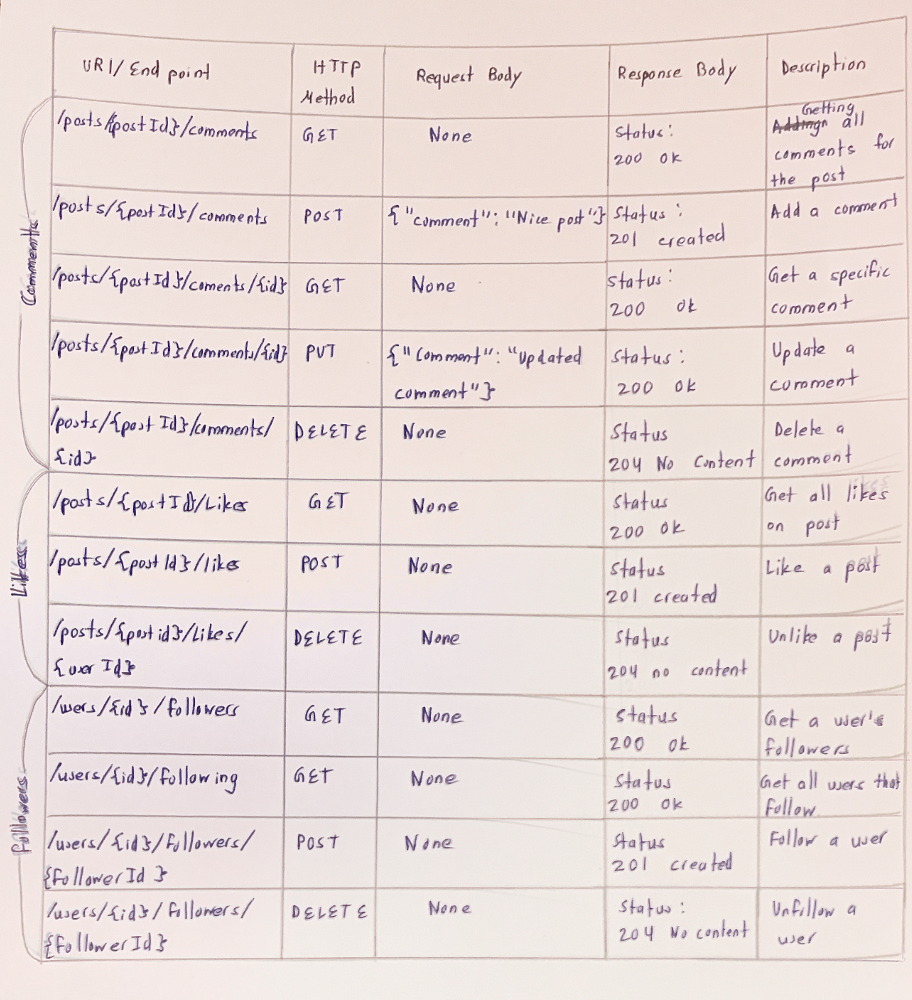

### Designing and Implementing RESTful API Endpoints
---- 

# Objectives
1. Design RESTful API endpoints following best practices for URI design
2. Implement API endpoints with proper HTTP methods and status codes
3. Configure content negotiation with different MIME types
4. Set up proper request and response handling
5. Document your API endpoints

## Part 1: API Design Exercise

# Scenario
You are building a social media platform similar to Instagram with the following resources:
● Posts
● Users
● Comments
● Likes
● Followers

# Tasks
1. For each resource, design endpoints for the following operations:
○ List all items
○ Get a specific item
○ Create a new item
○ Update an existing item
○ Delete an item

Example:
GET /posts - List all posts
GET /posts/{id} - Get a specific post

2. Complete the following table for your design:

